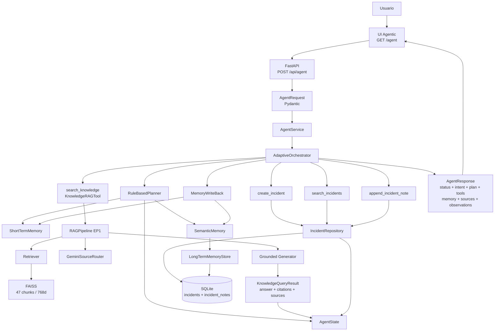
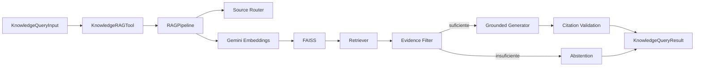
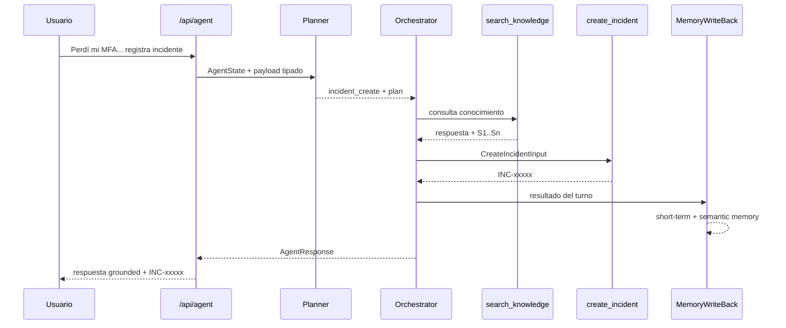
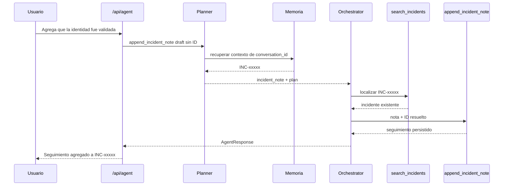
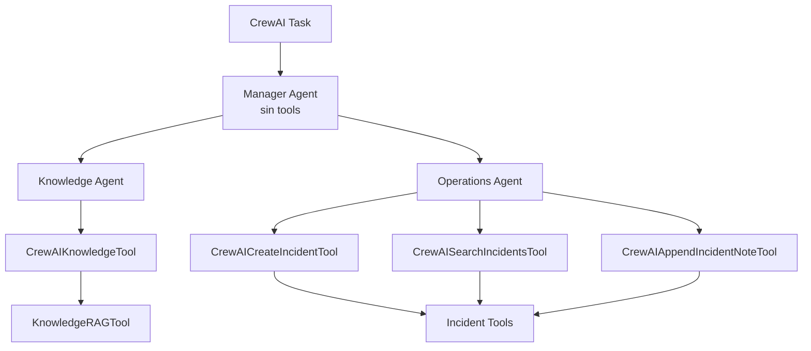
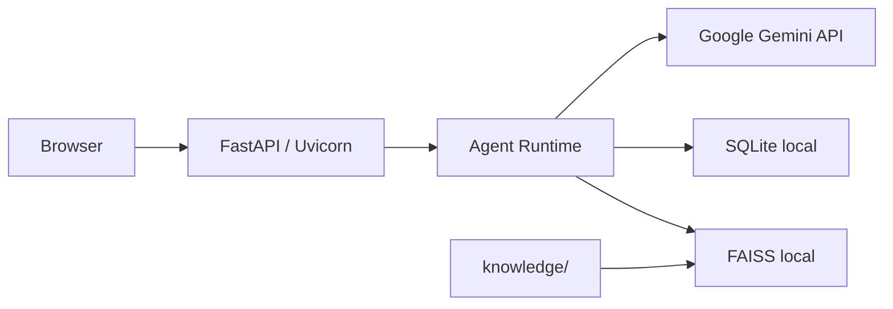

# Arquitectura Final EP2 — KnowledgeFlow Agent

## 1. Alcance del documento

Este documento describe la arquitectura **implementada y validada** de KnowledgeFlow Agent para la EP2 de ISY0101.

La solución evoluciona el RAG de EP1 hacia un runtime agentic con:

- planificación determinista;
- selección y ejecución de herramientas;
- memoria de corto y largo plazo;
- persistencia operacional;
- trazabilidad estructurada;
- API y UI agentic;
- una integración CrewAI jerárquica validada como camino separado.

> Importante: el endpoint principal `POST /api/agent` **no ejecuta CrewAI internamente**. El runtime principal y la integración CrewAI comparten tools de dominio, pero hoy son caminos de ejecución distintos.

---

## 2. Vista general



---

## 3. Capa de presentación

### 3.1 UI RAG heredada

Ruta:

```text
GET /
```

Se conserva para demostrar la funcionalidad original de EP1.

### 3.2 UI Agentic EP2

Ruta:

```text
GET /agent
```

La interfaz expone:

- `conversation_id`;
- tipo de ejecución;
- alcance documental;
- payloads tipados de escritura;
- status;
- intent;
- incident ID;
- iteraciones;
- plan y pasos completados;
- tool calls;
- memoria recuperada;
- fuentes RAG;
- observaciones operacionales;
- JSON técnico;
- follow-up guiado de incidentes.

La UI mantiene el `conversation_id` en la sesión del navegador para habilitar continuidad multi-turno.

---

## 4. Capa API

Endpoint principal:

```text
POST /api/agent
```

Entrada:

```text
AgentRequest
├── conversation_id
├── message
├── knowledge_query?
├── create_incident?
├── search_incidents?
└── append_incident_note?
```

Salida:

```text
AgentResponse
├── status
├── conversation_id
├── intent
├── plan
├── required_tools
├── tool_calls
├── completed_steps
├── memory_context
├── sources
├── observations
├── incident_id
├── requires_clarification
├── clarification_question
├── iteration_count
└── output
```

Los contratos HTTP son validados mediante Pydantic antes de entrar al runtime agentic.

---

## 5. Runtime agentic principal

### 5.1 AgentService

Responsabilidad:

- convertir `AgentRequest` en `AgentState`;
- preparar inputs tipados para tools;
- invocar el orquestador;
- mapear el resultado a `AgentResponse`.

### 5.2 AgentState

Representa el estado activo de un turno.

Contiene, entre otros:

```text
conversation_id
user_request
intent
plan
required_tools
retrieved_context
memory_context
selected_tool
tool_calls
observations
incident_id
completed_steps
requires_clarification
clarification_question
iteration_count
max_iterations
```

El estado operacional es distinto de la memoria persistente.

### 5.3 RuleBasedPlanner

Responsabilidades observadas:

- clasificar intención;
- generar pasos explícitos;
- seleccionar tools;
- hidratar memoria;
- resolver `incident_id`;
- solicitar aclaración cuando falta contexto;
- usar payloads operacionales validados como hints de intención.

Intenciones actuales:

```text
knowledge_query
incident_create
incident_search
incident_note
```

Prioridad de resolución de `incident_id`:

```text
1. ID explícito en el mensaje actual
2. ID ya presente en AgentState
3. mención más reciente en short-term memory
4. evento persistente más reciente en long-term memory
```

Esto evita que un score semántico ligeramente mayor seleccione un incidente antiguo frente al más reciente.

### 5.4 AdaptiveOrchestrator

Ejecuta el plan y aplica reglas de control.

Responsabilidades:

- registrar tool calls;
- registrar observaciones;
- detener el flujo ante abstención;
- bloquear escrituras dependientes de evidencia ausente;
- solicitar aclaración;
- validar consistencia de IDs;
- ejecutar write-back de memoria al finalizar.

Estados posibles:

```text
completed
needs_clarification
abstained
failed
```

---

## 6. Herramientas

### 6.1 search_knowledge

Implementación:

```text
KnowledgeRAGTool
```

Entrada:

```text
KnowledgeQueryInput
```

Salida:

```text
KnowledgeQueryResult
├── answer
├── citations
├── sources
└── abstained
```

La herramienta reutiliza el `RAGPipeline` de EP1 sin acoplarlo a FastAPI.

### 6.2 create_incident

Crea un incidente validado y retorna un identificador:

```text
INC-xxxxx
```

### 6.3 search_incidents

Permite recuperar incidentes por filtros soportados por el repositorio.

### 6.4 append_incident_note

Agrega seguimiento sin sobrescribir el historial del incidente.

Para follow-ups de memoria, la API puede recibir un draft sin ID. El orquestador materializa un `AppendIncidentNoteInput` completo solamente después de resolver el incidente desde contexto validado.

---

## 7. Subarquitectura RAG

El RAG de EP1 se conserva como componente reutilizable.



Configuración validada:

```text
Documentos: 8
Chunks: 47
Internal chunks: 13
External chunks: 34
Embeddings: gemini-embedding-2
Dimensión: 768
Vector store: FAISS / cosine similarity
Top-K: 4
Threshold: 0.60
```

La respuesta RAG preserva fuentes y citas al atravesar la frontera de tool.

---

## 8. Memoria

### 8.1 ShortTermMemory

Mantiene una ventana reciente por `conversation_id`.

Uso:

- contexto inmediato;
- mensajes user/assistant;
- recuperación de menciones recientes.

### 8.2 LongTermMemoryStore

Persistencia sobre SQLite para eventos relevantes.

### 8.3 SemanticMemory

Recupera memorias persistentes mediante embeddings y similitud coseno.

La recuperación está aislada por `conversation_id`.

### 8.4 MemoryWriteBack

Se ejecuta después de una ejecución agentic.

Guarda:

- solicitud del usuario;
- respuesta visible;
- creación de incidentes;
- seguimiento de incidentes.

No persiste indiscriminadamente cada consulta documental como evento operacional permanente.

---

## 9. Persistencia

Motor:

```text
SQLite
```

Tablas de dominio:

```text
incidents
incident_notes
memories
```

Acceso:

```text
IncidentTools
→ IncidentRepository
→ SQLite
```

El LLM y el planner no ejecutan SQL arbitrario.

---

## 10. Flujo multi-turno validado

### Turno 1 — RAG + escritura



### Turno 2 — continuidad por memoria



En este segundo turno no se ejecuta RAG porque la operación depende de memoria y persistencia operacional, no de nueva evidencia documental.

---

## 11. Decisiones adaptativas implementadas

| Condición observable | Comportamiento |
|---|---|
| Consulta documental | `search_knowledge` |
| Solicitud de creación de incidente | `search_knowledge → create_incident` |
| Follow-up con incidente recuperable | `search_incidents → append_incident_note` |
| Follow-up sin contexto resoluble | `needs_clarification` |
| RAG se abstiene en flujo dependiente | se bloquea la escritura |
| Tool o componente no disponible | `failed` controlado |
| Conflicto de incident ID | se evita escribir sobre un objetivo inconsistente |

---

## 12. Controles de seguridad y ejecución

Controles implementados:

- Pydantic en fronteras HTTP y tools;
- separación explícita lectura/escritura;
- `max_iterations`;
- tools con responsabilidades acotadas;
- no SQL arbitrario desde LLM;
- abstención del RAG;
- bloqueo de escritura cuando falta evidencia;
- aclaración antes de una escritura sin contexto;
- validación de existencia del incidente;
- aislamiento de memoria por `conversation_id`;
- trazabilidad de plan, tools y observaciones;
- API keys fuera del repositorio;
- vectorstore generado fuera de Git.

---

## 13. Integración CrewAI

La integración CrewAI existe en:

```text
app/integrations/
├── crewai_adapter.py
└── crewai_tools.py
```

Configuración validada:

```text
Process.hierarchical
Manager: allow_delegation=True
Manager tools: []
Knowledge Agent tools:
  - search_knowledge
Operations Agent tools:
  - create_incident
  - search_incidents
  - append_incident_note

CrewAI memory=False
CrewAI planning=False
```

Motivo técnico observable de `memory=False` y `planning=False`: la memoria y planificación del dominio están implementadas en componentes propios de KnowledgeFlow y no se duplican dentro de CrewAI.

### Camino CrewAI validado



Evidencia live:

- proceso jerárquico real;
- Manager sin tools;
- delegación al Knowledge Agent;
- RAG real ejecutado desde adapter;
- fuentes/citas preservadas;
- cero escrituras durante smoke read-only.

### Frontera actual

```text
GET /agent / POST /api/agent
    NO
    ↓
CrewAI
```

El runtime principal usa `AgentService + RuleBasedPlanner + AdaptiveOrchestrator`.

---

## 14. Despliegue local



Componentes locales:

- FastAPI/Uvicorn;
- FAISS;
- SQLite;
- corpus `knowledge/`;
- UI estática.

Servicio externo:

- Google Gemini API para embeddings y generación/router.

---

## 15. Trazabilidad visible

Cada `AgentResponse` puede exponer:

```text
status
intent
plan
required_tools
tool_calls
completed_steps
memory_context
sources
observations
incident_id
iteration_count
output
```

La UI muestra estos campos sin exponer razonamiento privado o chain-of-thought.

---

## 16. Evidencia de validación

Suite final:

```text
242 passed
20 warnings conocidos
pip check: No broken requirements found
compileall: OK
git diff --check: OK
working tree: clean
```

Evidencia live:

- RAG real;
- FAISS con 47 chunks;
- consulta MFA grounded;
- CrewAI jerárquico read-only;
- API agentic;
- creación de incidente;
- MemoryWriteBack;
- follow-up sin reenviar ID;
- UI multi-turno completa.

Documentos relacionados:

```text
docs/evidence/ep2-agent-demo-evidence.md
docs/evidence/ep2-demo-runbook.md
README.md
```

---

## 17. Archivos principales

```text
app/
├── agentic/
│   ├── orchestrator.py
│   ├── planner.py
│   ├── service.py
│   └── state.py
├── agents/
│   ├── knowledge_agent.py
│   ├── manager.py
│   └── operations_agent.py
├── api/
│   ├── agent_routes.py
│   ├── agent_schemas.py
│   └── routes.py
├── integrations/
│   ├── crewai_adapter.py
│   └── crewai_tools.py
├── memory/
│   ├── long_term.py
│   ├── semantic.py
│   ├── short_term.py
│   └── write_back.py
├── rag/
├── storage/
├── tools/
└── ui/static/
    ├── agent.html
    ├── agent.css
    └── agent.js
```

---

## 18. Uso en informe y presentación

Para el informe de EP2 conviene usar como diagrama principal la **Vista general** de la sección 2 y, si el espacio lo permite, el flujo multi-turno de la sección 10.

Para la presentación conviene separar visualmente:

1. runtime principal de `/api/agent`;
2. RAG como tool;
3. memoria/persistencia;
4. integración CrewAI validada por separado.

Este documento registra la arquitectura implementada; las justificaciones académicas y conclusiones deben ser redactadas por el equipo.
